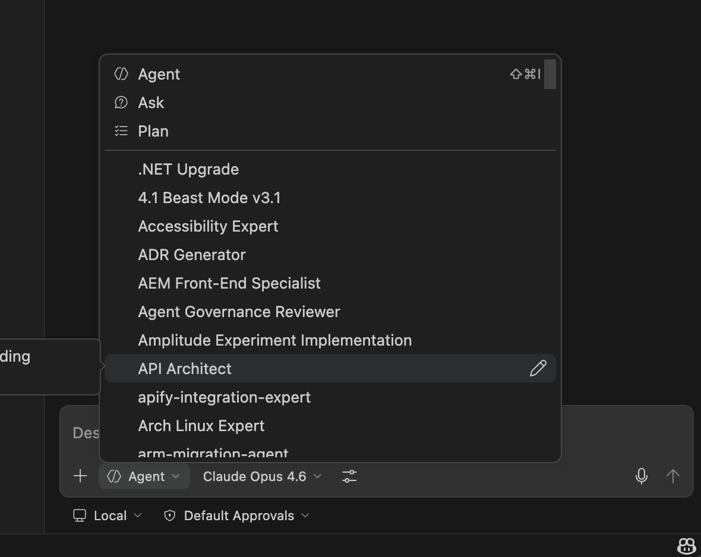
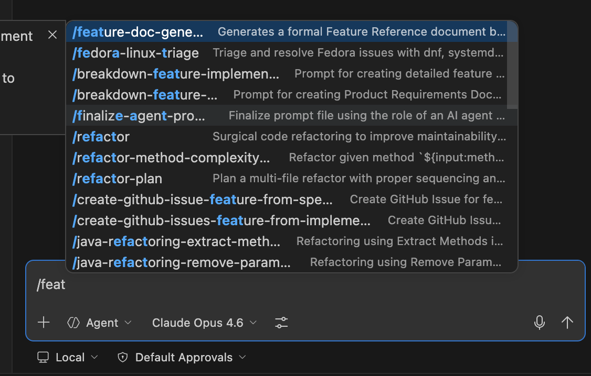

# Neeve Copilot

Welcome to the `neeve-copilot` repository! This project centralizes Neeve-specific AI agents, workflows, and tools that seamlessly integrate into the standard AI coding assistant experience along with the wider `awesome-copilot` ecosystem.

## 🚀 Installation

To install `neeve-copilot` into your local environment:

```bash
curl -fsSL https://raw.githubusercontent.com/neeve-ai/neeve-copilot/main/install.sh | sh
```

You can then restart your terminal or manually source your `.zshrc` / `.bashrc`.

### 🔄 Updating

To update the directory anytime, simply type:

```bash
update-neeve-copilot
```

## 💡 Usage

Once installed, your Copilot Chat is automatically enriched with Neeve-specific and community capabilities.

### Custom Agents
Custom Agents change the overarching behavior, default tools, and system instructions of your Copilot session.
Select a custom agent directly from the **agent dropdown menu** at the top of your Copilot Chat view:



### Agent Skills
Skills teach Copilot how to execute highly specific routines or workflows.
You can explicitly invoke a skill by typing `/` followed by the skill name in chat, or just ask Copilot a question naturally—it will dynamically load the correct skill based on your context!



## 🗑️ Uninstalling

If you need to completely remove `neeve-copilot` and the underlying `awesome-copilot` agents from your system, you can run the uninstaller. This will selectively erase the folders and safely clean the configuration out of your `~/.bashrc` or `~/.zshrc`.

```bash
curl -fsSL https://raw.githubusercontent.com/neeve-ai/neeve-copilot/main/uninstall.sh | sh
```

## 🛠️ Adding New Skills

We organize our internal skills inside `.agents/skills/`.
To propose a new agent or skill:
1. Create a directory for your skill: `.agents/skills/my-skill/`
2. Define a `SKILL.md` file following the Open Agent Skills specification.
3. Commit and submit a Pull Request.

Our CI workflow checks and validates skills before they merge!

### Example `SKILL.md`

```md
---
name: Database Architect
description: Assists the developer in modeling database interactions
disabled: false
---

# Instructions
When discussing the database...
```
