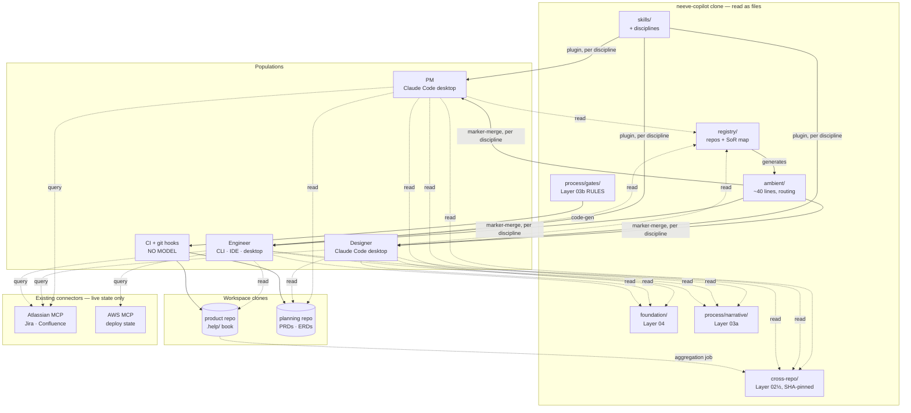

# Architecture — Neeve Agentic Framework, Redesigned

**Status:** Target architecture. Descriptive, not argumentative.
**Revised 2026-09-02** — the bespoke MCP connector is **out** (D7). One surface, three
populations, all knowledge read from git clones, all enforcement deterministic.

## How this document relates to its siblings

| Document | Answers | Register |
|---|---|---|
| `redesign-proposal.md` | **Why** — what is wrong today and what should change | Argumentative |
| **this file** | **What** — the target system and the rules that hold it together | Descriptive |
| `directory-redesign.md` | **Where** — how the target maps onto a filesystem | Concrete |
| `implementation-plan.md` | **How and when** — sequencing | Plan |
| `superseded/connector/**` | A service we decided **not** to build. Retained so the reasoning is findable | Historical |

Read this file to understand the system. Where documents disagree, this one wins.

---

## 1. The system in one paragraph

Knowledge lives in git, with exactly one authoritative home per domain. Agents read it from
a local clone. A small always-on block tells them where to look. Process rules that matter
are executable data enforced by hooks and CI. Three populations — engineering, product,
design — share one surface and receive only their own discipline's context. The only
network dependencies are the external systems that own live state.

---

## 2. Architectural invariants

These hold everywhere. A violation is a defect, not a trade-off.

| # | Invariant | Why it exists |
|---|---|---|
| **A-1** | **One knowledge domain, one system of record.** Mirrors permitted, labelled, never authoritative | A fact with two homes is a conflict, and a drifted mirror is trusted like the original |
| **A-2** | **No deterministic component calls a model.** Hooks and CI gates are mechanical | A validator that reasons can be reasoned with |
| **A-3** | **Anything a gate must read lives in git**, never behind interactive auth | CI has no human present to authenticate |
| **A-4** | **Staleness is loud.** Every derived or cross-repo claim records what it was verified against; drift is surfaced | A confident answer from a stale map is the failure this framework exists to prevent |
| **A-5** | **Derived artifacts are regenerated and diff-checked.** Editing a generated copy fails the build | Keeps A-1 true mechanically rather than by discipline |
| **A-6** | **Ambient context is a budget, not a home.** ~40 lines; its job is routing | It is read on every request, in every repo, by every user |
| **A-7** | **Fail closed.** A gate that cannot verify blocks; a source that cannot be read is reported, never substituted from memory | The alternative is silent wrongness |
| **A-8** | **Nothing is committed into product repos except their own Layer 02 book** | The property that lets ~16 repos adopt this without per-repo maintenance |
| **A-9** | **Storage location and delivery channel are independent.** Content living in git does not make it ambient | Collapsing them is how the 469-line payload gets reinvented |
| **A-10** | **No bespoke service.** Prefer a file in a clone, then an existing connector, then nothing | Every service is an uptime obligation, an auth model, and a pager |

---

## 3. Knowledge layers and their systems of record

| Layer | Content | System of record | Delivery | Volatility |
|---|---|---|---|---|
| **04** Foundation | Identity, personas, customers, product narrative | git `neeve-copilot/foundation/` | **Pull** (file read) | Static |
| **03a** Process — narrative | Why the loop is shaped this way; what good looks like | git `neeve-copilot/process/narrative/` | **Pull** | Quarterly |
| **03b** Process — executable | Gate commands, validation predicates, contracts, rule tiers | git `neeve-copilot/process/gates/` | **Pull + code-gen** | Quarterly |
| **02½** Cross-repo intel | Contracts and flows spanning repos that no single repo owns | git `neeve-copilot/cross-repo/` | **Pull**, SHA-pinned | Medium |
| **02** Repo context | The `.help/` OKF book | git — each product repo | **Pull** | **High** |
| **02** Product artifacts | PRDs, ERDs, design docs | Confluence **or** git planning repo | Query or Pull | Medium |
| **02** Live work state | Tickets, sprint state, deploy state | Jira · AWS | **Query**, never cached | Continuous |
| **01** Task frame | Current repo, goal, question, research | Nowhere — assembled per request | — | Per request |

Three notes.

**Layer 03 is split by purpose, not audience** — the narrative explains, the data enforces.
Both live in the same directory, so they review in one diff.

**Layer 02½ is new.** Cross-repo knowledge had no home: how auth flows across three repos,
which repos share a contract, the deployment topology as a whole. It is not derivable from
any single book, and it is the content most prone to silent rot — hence the SHA-pinned
freshness contract in §9.

**A-9 applies hardest to Layers 04 and 03a.** Being *stored* in git does not make them
ambient. They are read on demand, never rendered into the always-on block.

---

## 4. Delivery channels

Five ways knowledge reaches a model, distinguished by *when* it arrives and what it costs.

| Channel | Timing | Cost | Carries | Mechanism |
|---|---|---|---|---|
| **Ambient** | Every request | Tokens on every turn | Identity, precedence, **routing pointers** | Marker-merge into an instructions file |
| **Invocable** | On relevance | Tokens when matched | Skills, the router agent | Plugin, per discipline |
| **Pull** | When the agent reads | Tokens when read | Layers 04 · 03a · 02½ · 02 | **File read from a local clone** |
| **Query** | On demand | Nothing until asked | **Live external state only** | Existing Atlassian / AWS connectors |
| **Executable** | At gate time | No model involved | Layer 03b rules | Pre-commit hooks, CI |

**The Query channel is deliberately small.** An earlier design routed Layers 04/03a/02
through a bespoke MCP server. With every population holding a clone, those became file
reads — faster, offline-capable, no auth, no staleness window, no service to operate. Query
now holds only what genuinely cannot be a file: state that changes faster than any sync.

**The Executable channel is the one conventional context designs omit**, and it is where
enforcement lives. A rule delivered only through channels 1–4 is advice.

---

## 5. Surface and populations

**One surface, three populations.** claude.ai is explicitly not supported.

| Surface | Populations | Filesystem | git | Hooks | Plugins | Enforcement ceiling |
|---|---|---|---|---|---|---|
| **Claude Code — desktop app** | **PMs · designers · engineers** | yes | yes | yes | yes | **`Blocked`** |
| **Claude Code — CLI / IDE** | engineers | yes | yes | yes | yes | **`Blocked`** |
| Other tools (Codex · Cursor · Copilot · Antigravity) | engineers, opportunistic | yes | yes | no | no | `Surfaced` |
| **CI & hooks** (no model at all) | — | yes | yes | — | — | **`Blocked`** |

Two consequences.

**Enforcement is uniform.** Every population commits to git, so every population is gated by
the same pre-commit hooks and CI checks. There is no channel asymmetry, no population that
tops out at `Advised`, and no need for a service to gate anyone.

**The discipline split becomes the primary rationale for the redesign, not a supporting
move.** Three populations share one ambient plane. Today a UX designer opening Claude Code
receives `mypy --strict`, `pytest --cov-fail-under=95`, and "never import infrastructure
concerns into the domain layer" as *mandatory, precedence-winning* rules. With one surface
there is no workaround — per-discipline context is the only fix.

---

## 6. System topology



Four things the diagram is drawn to show:

1. **No bespoke service.** Every knowledge arrow is a file read from a clone or an existing
   connector. Nothing in the picture has a pager.
2. **`registry/` generates `ambient/`.** Routing cannot drift from the source map.
3. **`process/gates/` feeds CI by code-gen** — defined once, enforced in every workspace.
4. **No arrow runs from `foundation/` into `ambient/`.** That absence is invariant A-9, drawn.

---

## 7. Component inventory

| Component | Kind | Owns | Notes |
|---|---|---|---|
| `ambient/` | Rendered content | The ~40-line always-on block, per discipline | `routing.md` generated from `registry/sources.yaml` |
| `foundation/` | Content | **Layer 04** | Read on demand, never pushed (A-9) |
| `process/narrative/` | Content | **Layer 03a** | Beside the rules it explains |
| `process/gates/` | **Data** | **Layer 03b**: gates, predicates, contracts, tiers | Code-gen'd into hooks and CI; never network-served (A-3) |
| `cross-repo/` | Content + metadata | **Layer 02½** | Each entry records the repo SHAs it was verified against (§9) |
| `registry/` | Data | Repo registry, source-of-record map | Replaces the 84-line pushed topology table |
| `disciplines/` | Packaging | Which skills, references, and ambient block ship together | Glob-discovered |
| `skills/` | Content | Task playbooks | Membership declared in frontmatter, not location |
| `agent/neeve/` | Content | The single discipline-aware router | Name never changes (§10) |
| `surfaces/` | Mechanism | Plugin build, marker-merge, thin tool adapters | One directory per surface |
| `tools/` | Mechanism | Render, merge, check, `init_workspace.sh` | Never calls a model (A-2) |
| `templates/` | Scaffolds | `.help/` book, pre-commit hook, CI workflows, **workspace `.claude/settings.json`** | Installed into workspaces |
| `evals/` | Verification | Per-skill eval cases | The measurement half of the feedback loop |
| Aggregation job | Mechanism | Pulls `.help/` books into a searchable local set | A scheduled job, not a service (A-10) |
| Atlassian · AWS MCP | External peer | Live state | Adopted, not built |

---

## 8. Enforcement architecture

Every process rule carries a tier, declared in `process/tiers.yaml`.

| Tier | Mechanism | Available to |
|---|---|---|
| **Blocked** | A deterministic check prevents the bad state | **All three populations**, via pre-commit and CI |
| **Surfaced** | The gap is made loud at the moment of work | hooks, warnings, TODO markers, stale-SHA flags |
| **Advised** | Prose a model reads and may follow | ambient block, skill bodies |

**Uniform across populations, split by substrate.** A markdown PRD in a git planning repo is
gated by a linter in CI — genuinely `Blocked`. A PRD authored as a Confluence page cannot be
gated, because CI cannot read a wiki reliably in a headless run (A-3); it tops out at
`Surfaced`. That is the real cost of the Confluence choice, and it is a substrate decision,
not a population one.

**North-star metric:** the share of rules at `Blocked` or `Surfaced` rather than `Advised`,
computable from `process/tiers.yaml` in CI.

---

## 9. Freshness contracts

Three mechanisms, all deterministic, all model-free.

| Content | Contract | Enforced by |
|---|---|---|
| Layer 02 book | Manifest hash + public-symbol diff against the repo's own code | Committed `pre-commit-context-sync`; warn-only until a repo opts into blocking |
| **Layer 02½ cross-repo intel** | Each entry records `verified-against:` repo SHAs. A scheduled check flags entries whose repos have moved past them | Same manifest-hash pattern, pointed at `cross-repo/` |
| Framework clone | SessionStart hook pulls and reinstalls when HEAD moves | `refresh-context.sh`, scoped to the tools the engineer actually selected |

The cross-repo contract matters most because that content is the least owned and the fastest
to rot. Without it, `cross-repo/` becomes the wiki page that was accurate in March — which is
precisely the failure mode this framework exists to make loud.

---

## 10. Stability commitments

Deliberately frozen, because changing them breaks installed state:

| Frozen | Why |
|---|---|
| The agent name `neeve` | Written into `~/.claude/settings.json` with `--only-if-unset`, so the installer can **never** self-heal a rename |
| The `BEGIN/END` marker label | Present in every user's personal instructions file; a change orphans the old block and installs a second, contradictory one |
| `neeve.contextsync.*` git config keys | Set per developer, committed per repo; renaming silently reverts enforcement to defaults |
| Skill directory names, once published to a marketplace | Marketplaces support a `renames` field, but only if the migration entry exists. Rename in the flatten commit or carry the migration |

Any future rename must be a *supported operation* — a known-legacy list the merge code
migrates forward from — not a one-way door.

---

## 11. Feedback loop

```
work happens → correction occurs → recorded in that workspace's .help/lessons.md
     → scheduled job aggregates lessons across repos
          → attributed to the artifact that caused it (skill · gate · book · cross-repo entry)
               → that artifact updated
                    → eval case added
                         → CI proves the fix holds
```

A correction is a signal about **the artifact**, not just the workspace where it surfaced.
The aggregation is a scheduled job over clones — not a service (A-10).

---

## 12. Degradation

| Failure | Effect | Populations affected |
|---|---|---|
| Framework clone stale | SessionStart hook refreshes; if it fails, content is merely older, and hooks still flag drift | All, equally |
| Git remote unreachable | **No impact on reading.** Everything needed is in the clone. Commits queue locally | All, equally |
| Atlassian / AWS down | Live state unavailable; Confluence-hosted artifacts unreadable | All, equally |
| CI down | Gates unenforced until restored | All, equally |
| Book or cross-repo entry stale | Flagged loudly by the freshness check (§9) | All, equally |

**There is no asymmetry and no single point of failure.** An earlier design put a service in
the read path, which cost one population everything on an outage while another degraded
gracefully. Removing it removed the asymmetry — the main architectural benefit of D7, ahead
of the saved build effort.

---

## 13. Deliberately not in this architecture

- **No bespoke service, MCP server, or hosted component** (A-10, D7).
- No model calls in any deterministic component (A-2).
- No second copy of any fact (A-1); no caching of live state.
- No knowledge database. Files in git, read directly.
- No browser-only surface. claude.ai is out of scope.
- No per-product-repo installation beyond that repo's own book and hook (A-8).
- No UI. The AI clients are the UI.
- No path to OT networks or building equipment, now or later.

---

## 14. Architectural risks

Ordered by how much they would invalidate rather than adjust.

1. **Onboarding cost for non-engineers on a developer-shaped surface.** Claude Code desktop
   assumes a development environment. If a PM or designer cannot get through install and
   clone, they do not use the framework at all — a worse failure than any context gap.
   **Mitigation:** the workspace provisions itself. A committed `.claude/settings.json` with
   `extraKnownMarketplaces` + `enabledPlugins` auto-registers and enables the right discipline
   plugin on folder trust. Setup becomes: install the app, clone one repo, trust it.
2. **Product and design workflow content does not exist.** `process/workflow.yaml` encodes an
   eight-stage engineering loop; `disciplines/design/` has no ambient block. This now blocks
   two live populations rather than deferring a hypothetical, and it needs named authors — a
   PM and a designer — not a plan.
3. **Discoverability.** The Pull channel assumes the agent *reads the file*. More reliable
   than a tool call, and the framework already carries a partial answer ("read the repo's map
   before grepping cold"), but the routing block's wording is load-bearing and should be
   versioned and tested like code.
4. **`cross-repo/` has no authoring path yet.** A knowledge store with no way to get populated
   stays empty regardless of where it lives. The fix is a `repo-intel` cross-repo mode, which
   is a skill change rather than infrastructure.
5. **Corpus quality caps everything.** Books are uneven and TS/Go symbol detection is
   conservative. No mechanism exceeds its sources.
6. **The rename migration fails silently.** `.neeve-manifest` prunes by directory name, so a
   rename without a migration entry leaves old skills installed forever on machines that
   synced earlier — the only breakage in the plan that is quiet on someone else's machine.
7. **Confluence-hosted artifacts cannot be gated** (§8). Accept `Surfaced`, or move them to a
   git planning repo.

---

## 15. Decision index

| ID | Decision | Status |
|---|---|---|
| **D1** | Discipline membership declared in frontmatter, not location | Active |
| **D2** | One default agent, `neeve`, never renamed | Active |
| **D3** | Discipline plugins: core + engineering + product + design | Active |
| **D4** | Two planes — ambient vs invocable — with different mechanisms | Active |
| **D5** | Layers 04 + 03a live in git, not in a third-party corpus | Active — was connector ADR-11 |
| **D6** | Process narrative split from executable rules, both in git | Active — was connector ADR-10 |
| **D7** | **No bespoke connector.** Files in a clone, plus existing Atlassian/AWS connectors | **Active — see below** |
| **D8** | Cross-repo intel in git with a SHA-pinned freshness contract | Active |
| **D9** | One surface (Claude Code, desktop for non-engineers), three populations | Active |
| **D10** | Workspaces self-provision via a committed `.claude/settings.json` | Active |
| ~~ADR-9~~ | ~~Layers 03/04 exclusively in NotebookLM~~ | Superseded by D5 |
| ~~ADR-1…8, 11~~ | Connector-internal decisions | Moot under D7; retained in `superseded/connector/` |

### D7 — why there is no connector

The connector was justified almost entirely by a browser population. With claude.ai out of
scope, the scorecard collapses:

| Original justification | Survives? |
|---|---|
| Serves both surfaces | No — there is one surface |
| Only grounding channel for users with no filesystem or git | No — every population has both |
| Only path to `Blocked` on the web | No — CI and pre-commit reach everyone |
| Freshness by construction | No — a clone plus the SessionStart pull already does this |
| Governed writes with validation | No — a pre-commit linter on a git planning repo is deterministic and needs no service |
| Append-only audit trail | No — git *is* the audit trail, with better properties |
| Ends process-definition duplication | No — `process/` in git does that |
| Cross-repo grounding | **Partially** — replaced by `cross-repo/` plus an aggregation job |

What it would have cost: a service with an uptime obligation, an auth model, a secret store,
a deploy pipeline, an on-call owner, a new internet-facing authenticated surface holding an
aggregate of internal knowledge, and a prompt-injection vector — in exchange for capabilities
a file read and a git hook provide.

**Trigger condition for revisiting.** If a population appears that cannot install anything —
browser-only by policy or by role — the connector is the only path to serving them, and this
decision is what to reopen. Design detail is preserved in `superseded/connector/**` rather
than rebuilt from scratch. Do not build for it speculatively.
