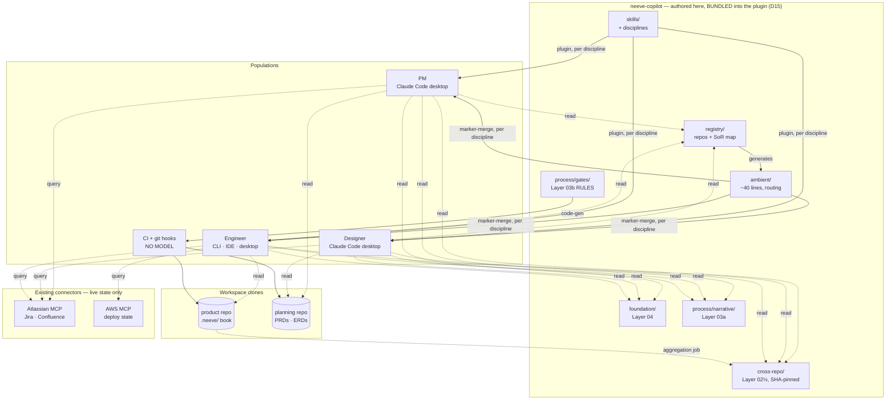

# Architecture — Neeve Agentic Framework, Redesigned

**Status:** Target architecture. Descriptive, not argumentative.
**Revised 2026-09-03** — the bespoke MCP connector is **out** (D7). One surface, three
populations, all enforcement deterministic. Pull-channel content is **delivered by the plugin**,
so consumers never clone this repo (D15). The harness is
**product-agnostic** (D12), the OT skill is retired (D13), and content stays in one repo with
a structural boundary rather than a bundle split (D14).

## How this document relates to its siblings

| Document | Answers | Register |
|---|---|---|
| `redesign-proposal.md` | **Why** — what is wrong today and what should change | Argumentative |
| **this file** | **What** — the target system and the rules that hold it together | Descriptive |
| `directory-redesign.md` | **Where** — how the target maps onto a filesystem | Concrete |
| `implementation-plan.md` | **How and when** — sequencing | Plan |
| `superseded/connector/**` | A service we decided **not** to build. Retained so the reasoning is findable | Historical |

Read this file to understand the system. Where documents disagree, this one wins.

---

## 1. The system in one paragraph

Knowledge lives in git, with exactly one authoritative home per domain. Agents read it from
content bundled into the plugin they installed — consumers never clone this repo. A small always-on block tells them where to look. Process rules that matter
are executable data enforced by hooks and CI. Three populations — engineering, product,
design — share one surface and receive only their own discipline's context. The only
network dependencies are the external systems that own live state.

---

## 2. Architectural invariants

These hold everywhere. A violation is a defect, not a trade-off.

| # | Invariant | Why it exists |
|---|---|---|
| **A-1** | **One knowledge domain, one system of record.** Mirrors permitted, labelled, never authoritative | A fact with two homes is a conflict, and a drifted mirror is trusted like the original |
| **A-2** | **No deterministic component calls a model.** Hooks and CI gates are mechanical | A validator that reasons can be reasoned with |
| **A-3** | **Anything a gate must read lives in git**, never behind interactive auth | CI has no human present to authenticate |
| **A-4** | **Staleness is loud.** Every derived or cross-repo claim records what it was verified against; drift is surfaced | A confident answer from a stale map is the failure this framework exists to prevent |
| **A-5** | **Derived artifacts are regenerated and diff-checked.** Editing a generated copy fails the build | Keeps A-1 true mechanically rather than by discipline |
| **A-6** | **Ambient context is a budget, not a home.** ~40 lines; its job is routing | It is read on every request, in every repo, by every user |
| **A-7** | **Fail closed.** A gate that cannot verify blocks; a source that cannot be read is reported, never substituted from memory | The alternative is silent wrongness |
| **A-8** | **Nothing is committed into product repos except their own Layer 02 book** | The property that lets ~16 repos adopt this without per-repo maintenance |
| **A-9** | **Storage location and delivery channel are independent.** Content living in git does not make it ambient | Collapsing them is how the 469-line payload gets reinvented |
| **A-10** | **No bespoke service.** Prefer a file in a clone, then an existing connector, then nothing | Every service is an uptime obligation, an auth model, and a pager |
| **A-11** | **The harness names no product in a prompt.** Product identity enters through the workspace — never through ambient context, a skill body, or the router | A product fact held in the framework has no connection to that product's code or roadmap, so nothing can verify it and it rots silently. That is the exact failure this framework exists to prevent, which makes the framework the worst possible home for it |

---

## 3. Knowledge layers and their systems of record

| Layer | Content | System of record | Delivery | Volatility |
|---|---|---|---|---|
| **04** Foundation | Identity, personas, customers, product narrative | git `neeve-copilot/foundation/` | **Pull** (file read) | Static |
| **03a** Process — narrative | Why the loop is shaped this way; what good looks like | git `neeve-copilot/process/narrative/` | **Pull** | Quarterly |
| **03b** Process — executable | Gate commands, validation predicates, contracts, rule tiers | git `neeve-copilot/process/gates/` | **Pull + code-gen** | Quarterly |
| **02½** Cross-repo intel | Contracts and flows spanning repos that no single repo owns | git `neeve-copilot/cross-repo/` | **Pull**, SHA-pinned | Medium |
| **02** Repo context | The `.neeve/` OKF book | git — each product **code** repo | **Pull** | **High** |
| **02** Product knowledge | What the product is, who buys it, why | git — that product's **planning workspace** `.neeve/` book | **Pull** | Medium |
| **02** Product artifacts | PRDs, ERDs, design docs | Confluence **or** git planning repo | Query or Pull | Medium |
| **02** Live work state | Tickets, sprint state, deploy state | Jira · AWS | **Query**, never cached | Continuous |
| **01** Task frame | Current repo, goal, question, research | Nowhere — assembled per request | — | Per request |

Three notes.

**Layer 03 is split by purpose, not audience** — the narrative explains, the data enforces.
Both live in the same directory, so they review in one diff.

**Layer 02½ is new.** Cross-repo knowledge had no home: how auth flows across three repos,
which repos share a contract, the deployment topology as a whole. It is not derivable from
any single book, and it is the content most prone to silent rot — hence the SHA-pinned
freshness contract in §9.

**A-9 applies hardest to Layers 04 and 03a.** Being *stored* in git does not make them
ambient. They are read on demand, never rendered into the always-on block.

---

## 4. Delivery channels

Five ways knowledge reaches a model, distinguished by *when* it arrives and what it costs.

| Channel | Timing | Cost | Carries | Mechanism |
|---|---|---|---|---|
| **Ambient** | Every request | Tokens on every turn | Identity, precedence, **routing pointers** | Marker-merge into an instructions file |
| **Invocable** | On relevance | Tokens when matched | Skills, the router agent | Plugin, per discipline |
| **Pull** | When the agent reads | Tokens when read | Layers 04 · 03a · 02½ · 02 | **File read from the installed plugin** (Layer 02 from the workspace itself) |
| **Query** | On demand | Nothing until asked | **Live external state only** | Existing Atlassian / AWS connectors |
| **Executable** | At gate time | No model involved | Layer 03b rules | Pre-commit hooks, CI |

**The Query channel is deliberately small.** An earlier design routed Layers 04/03a/02
through a bespoke MCP server; a later one had consumers clone this repo. Both are gone. The
content now ships *inside the plugin* — faster than a query, offline-capable, no auth, no
staleness window, no service, and **no clone**. Query holds only what genuinely cannot be a
file: state that changes faster than any sync.

**Pull does not mean "clone the framework."** See D15 — that distinction is the whole reason
an end user's install is three slash commands rather than a git workflow.

**The Executable channel is the one conventional context designs omit**, and it is where
enforcement lives. A rule delivered only through channels 1–4 is advice.

---

## 5. Surface and populations

**One surface, three populations.** claude.ai is explicitly not supported.

| Surface | Populations | Filesystem | git | Hooks | Plugins | Enforcement ceiling |
|---|---|---|---|---|---|---|
| **Claude Code — desktop app** | **PMs · designers · engineers** | yes | yes | yes | yes | **`Blocked`** |
| **Claude Code — CLI / IDE** | engineers | yes | yes | yes | yes | **`Blocked`** |
| Other tools (Codex · Cursor · Copilot · Antigravity) | engineers, opportunistic | yes | yes | no | no | `Surfaced` |
| **CI & hooks** (no model at all) | — | yes | yes | — | — | **`Blocked`** |

Two consequences.

**Enforcement is uniform.** Every population commits to git, so every population is gated by
the same pre-commit hooks and CI checks. There is no channel asymmetry, no population that
tops out at `Advised`, and no need for a service to gate anyone.

**The discipline split becomes the primary rationale for the redesign, not a supporting
move.** Three populations share one ambient plane. Today a UX designer opening Claude Code
receives `mypy --strict`, `pytest --cov-fail-under=95`, and "never import infrastructure
concerns into the domain layer" as *mandatory, precedence-winning* rules. With one surface
there is no workaround — per-discipline context is the only fix.

---

## 6. System topology



Four things the diagram is drawn to show:

1. **No bespoke service.** Every knowledge arrow is a file read from a clone or an existing
   connector. Nothing in the picture has a pager.
2. **`registry/` generates `ambient/`.** Routing cannot drift from the source map.
3. **`process/gates/` feeds CI by code-gen** — defined once, enforced in every workspace.
4. **No arrow runs from `foundation/` into `ambient/`.** That absence is invariant A-9, drawn.

---

## 7. Component inventory

| Component | Kind | Owns | Notes |
|---|---|---|---|
| `ambient/` | Rendered content | The ~40-line always-on block, per discipline | `routing.md` generated from `registry/sources.yaml` |
| `foundation/` | Content | **Layer 04** | Read on demand, never pushed (A-9). **Bundled into `neeve-core` at build time** (D15) |
| `process/narrative/` | Content | **Layer 03a** | Beside the rules it explains. Bundled into `neeve-core` (D15) |
| `process/gates/` | **Data** | **Layer 03b**: gates, predicates, contracts, tiers | Code-gen'd into hooks and CI; never network-served (A-3) |
| `cross-repo/` | Content + metadata | **Layer 02½** | Each entry records the repo SHAs it was verified against (§9). Bundled into `neeve-core` (D15) |
| `registry/` | Data | Repo registry, source-of-record map | Replaces the 84-line pushed topology table. **The index to product knowledge; never the content** (D12). Bundled into `neeve-core` (D15) |
| `disciplines/` | Packaging | Which skills, references, and ambient block ship together | Glob-discovered |
| `skills/` | Content | Task playbooks | Membership declared in frontmatter, not location |
| `agent/neeve/` | Content | The single discipline-aware router | Name never changes (§11) |
| `surfaces/` | Mechanism | Plugin build, marker-merge, thin tool adapters | One directory per surface |
| `tools/` | Mechanism | Render, merge, check, `init_workspace.sh` | Never calls a model (A-2) |
| `templates/` | Scaffolds | `.neeve/` book, pre-commit hook, CI workflows, **workspace `.claude/settings.json`** | Installed into workspaces |
| `evals/` | Verification | Per-skill eval cases | The measurement half of the feedback loop |
| Aggregation job | Mechanism | Pulls `.neeve/` books into a searchable local set | A scheduled job, not a service (A-10) |
| Atlassian · AWS MCP | External peer | Live state | Adopted, not built |

---

## 8. Enforcement architecture

Every process rule carries a tier, declared in `process/tiers.yaml`.

| Tier | Mechanism | Available to |
|---|---|---|
| **Blocked** | A deterministic check prevents the bad state | **All three populations**, via pre-commit and CI |
| **Surfaced** | The gap is made loud at the moment of work | hooks, warnings, TODO markers, stale-SHA flags |
| **Advised** | Prose a model reads and may follow | ambient block, skill bodies |

**Uniform across populations, split by substrate.** A markdown PRD in a git planning repo is
gated by a linter in CI — genuinely `Blocked`. A PRD authored as a Confluence page cannot be
gated, because CI cannot read a wiki reliably in a headless run (A-3); it tops out at
`Surfaced`. That is the real cost of the Confluence choice, and it is a substrate decision,
not a population one.

**North-star metric:** the share of rules at `Blocked` or `Surfaced` rather than `Advised`,
computable from `process/tiers.yaml` in CI.

---

## 9. Freshness contracts

Three mechanisms, all deterministic, all model-free.

| Content | Contract | Enforced by |
|---|---|---|
| Layer 02 book | Manifest hash + public-symbol diff against the repo's own code | Committed `pre-commit-context-sync`; warn-only until a repo opts into blocking. Resolves `.neeve/` then falls back to `.help/` during migration (D11) |
| **Layer 02½ cross-repo intel** | Each entry records `verified-against:` repo SHAs. A scheduled check flags entries whose repos have moved past them | Same manifest-hash pattern, pointed at `cross-repo/` |
| Framework content, for a **consumer** | Rendered per session from the installed plugin version — there is no stored copy to go stale (D15) | The plugin's own `SessionStart` hook; freshness follows plugin updates |
| Framework content, for a **contributor** | SessionStart hook pulls and reinstalls when HEAD moves | `refresh-context.sh`, scoped to the tools they actually selected |

The cross-repo contract matters most because that content is the least owned and the fastest
to rot. Without it, `cross-repo/` becomes the wiki page that was accurate in March — which is
precisely the failure mode this framework exists to make loud.

---

## 10. Rollout

How a change reaches a user. There is no single mechanism — four paths, with materially
different latencies.

| Artifact | Mechanism | Latency | Who acts |
|---|---|---|---|
| Skills, router agent, bundled content, ambient hook | plugin version bump → marketplace | next plugin update | nobody, if `autoUpdate` |
| **The ambient block itself** | rides the plugin; rendered per session | **next session** | nobody |
| **Executable gates (`process/gates/`)** | regenerate → commit into each product repo | **weeks** | someone, per repo |
| Adapter tools (Codex · Cursor · Copilot · Antigravity) | re-run the installer | manual | each engineer |
| Workspace `.claude/settings.json` | commit per workspace | rarely changes | someone, per workspace |

**The ambient block is the best of these, and it is a side effect rather than a design goal.**
Today it is a marker-merged file that changes only when someone re-runs the installer, so a
stale copy can sit on a machine indefinitely. Under D15 it is rendered per session from the
installed plugin, so there is no stored copy to be stale — zero latency, zero action.

**Rollback and canarying come free from plugin versioning.** `plugin.json`'s `version` pins, so
rolling back is pinning the previous version, and a version can be canaried by pointing one
workspace's `enabledPlugins` at it before broadening.

### 10.1 The gap: gate rules reaching product repos

§9 answers *is this stale?* It does not answer *how does a changed rule in `process/gates/`
reach sixteen committed pre-commit hooks?* Today it does not: someone regenerates and commits
a new hook per repo. That is a campaign, not a rollout.

Note the history before proposing a fix — a per-repo bot-PR mechanism was **tried and
abandoned** (`docs/Feature-Reference.md`) because it fought the centralized,
nothing-per-repo model. Re-proposing it naively repeats a known mistake.

Two things make it tractable:

**CI and the local hook may diverge deliberately.** CI has network access and can fetch the
current rules on every run, so **CI enforcement updates immediately** and only the *local*
pre-commit hook lags. Since CI is the blocking gate and pre-commit is fast feedback, a lagging
local hook is tolerable in a way a lagging CI check would not be.

**Version the generated hook and let it say so.** The hook's job is surfacing mechanical facts;
*"your gate rules are three versions behind"* is exactly that kind of fact, and it converts a
silent lag into a `Surfaced` one (A-4).

What to avoid: having the pre-commit hook fetch rules at runtime. It adds a network dependency
to something that must work offline in under a second, and it breaks A-3 — a gate reads its
rulebook with no human and no network in the loop.

### 10.2 One asymmetry D15 introduces

D15 removes the clone for Claude Code consumers, but **adapter-tool users still need one** —
Codex, Cursor, Copilot, and Antigravity have no plugin system, so they receive skills copied by
the installer and house rules marker-merged, which requires the repo. That population is
engineers only, who mostly hold a clone anyway. Accepted rather than solved, but stated so
nobody discovers it.

### 10.3 Unverified

Whether `autoUpdate: true` on a marketplace entry updates installed *plugin content*
automatically, or only refreshes marketplace metadata and still needs a user action. The
difference decides whether "nobody acts" in the table above is true or aspirational. Tracked
as part of P7's verification.

---
## 11. Stability commitments

Deliberately frozen, because changing them breaks installed state:

| Frozen | Why |
|---|---|
| The agent name `neeve` | Written into `~/.claude/settings.json` with `--only-if-unset`, so the installer can **never** self-heal a rename |
| The `BEGIN/END` marker label | Present in every user's personal instructions file; a change orphans the old block and installs a second, contradictory one |
| `neeve.contextsync.*` git config keys | Set per developer, committed per repo; renaming silently reverts enforcement to defaults |
| Skill directory names, once published to a marketplace | Marketplaces support a `renames` field, but only if the migration entry exists. Rename in the flatten commit or carry the migration |
| The per-repo book directory name | Committed into ~16 product repos and referenced by each one's own hook and `.dockerignore`. **Held as a value in `framework.yaml`, not a literal**, so a future change is a config edit plus a dual-path fallback rather than a coordinated flag day (D11) |

Any future rename must be a *supported operation* — a known-legacy list the merge code
migrates forward from — not a one-way door.

---

## 12. Feedback loop

```
work happens → correction occurs → recorded in that workspace's .neeve/lessons.md
     → scheduled job aggregates lessons across repos
          → attributed to the artifact that caused it (skill · gate · book · cross-repo entry)
               → that artifact updated
                    → eval case added
                         → CI proves the fix holds
```

A correction is a signal about **the artifact**, not just the workspace where it surfaced.
The aggregation is a scheduled job over clones — not a service (A-10).

---

## 13. Degradation

| Failure | Effect | Populations affected |
|---|---|---|
| Framework clone stale | SessionStart hook refreshes; if it fails, content is merely older, and hooks still flag drift | All, equally |
| Git remote unreachable | **No impact on reading.** Everything needed is in the installed plugin and the current workspace. Commits queue locally | All, equally |
| Atlassian / AWS down | Live state unavailable; Confluence-hosted artifacts unreadable | All, equally |
| CI down | Gates unenforced until restored | All, equally |
| Book or cross-repo entry stale | Flagged loudly by the freshness check (§9) | All, equally |

**There is no asymmetry and no single point of failure.** An earlier design put a service in
the read path, which cost one population everything on an outage while another degraded
gracefully. Removing it removed the asymmetry — the main architectural benefit of D7, ahead
of the saved build effort.

---

## 14. Deliberately not in this architecture

- **No bespoke service, MCP server, or hosted component** (A-10, D7).
- No model calls in any deterministic component (A-2).
- No second copy of any fact (A-1); no caching of live state.
- No knowledge database. Files in git, read directly.
- No browser-only surface. claude.ai is out of scope.
- **No requirement that a consumer clone this repo.** Contributors clone; users install a
  plugin (D15).
- No per-product-repo installation beyond that repo's own book and hook (A-8).
- No UI. The AI clients are the UI.
- No path to OT networks or building equipment, now or later.

---

## 15. Architectural risks

Ordered by how much they would invalidate rather than adjust.

1. **Onboarding cost for non-engineers on a developer-shaped surface.** Claude Code desktop
   assumes a development environment. If a PM or designer cannot get through install and
   clone, they do not use the framework at all — a worse failure than any context gap.
   **Mitigation:** the workspace provisions itself. A committed `.claude/settings.json` with
   `extraKnownMarketplaces` + `enabledPlugins` auto-registers and enables the right discipline
   plugin on folder trust. Setup becomes: install the app, clone one repo, trust it.
2. **Product and design workflow content does not exist.** `process/workflow.yaml` encodes an
   eight-stage engineering loop; `disciplines/design/` has no ambient block. This now blocks
   two live populations rather than deferring a hypothetical, and it needs named authors — a
   PM and a designer — not a plan.
3. **Discoverability.** The Pull channel assumes the agent *reads the file*. More reliable
   than a tool call, and the framework already carries a partial answer ("read the repo's map
   before grepping cold"), but the routing block's wording is load-bearing and should be
   versioned and tested like code.
4. **`cross-repo/` has no authoring path yet.** A knowledge store with no way to get populated
   stays empty regardless of where it lives. The fix is a `repo-intel` cross-repo mode, which
   is a skill change rather than infrastructure.
5. **Corpus quality caps everything.** Books are uneven and TS/Go symbol detection is
   conservative. No mechanism exceeds its sources.
6. **The rename migration fails silently.** `.neeve-manifest` prunes by directory name, so a
   rename without a migration entry leaves old skills installed forever on machines that
   synced earlier — the only breakage in the plan that is quiet on someone else's machine.
7. **Confluence-hosted artifacts cannot be gated** (§8). Accept `Surfaced`, or move them to a
   git planning repo.

---

## 16. Decision index

| ID | Decision | Status |
|---|---|---|
| **D1** | Discipline membership declared in frontmatter, not location | Active |
| **D2** | One default agent, `neeve`, never renamed | Active |
| **D3** | Discipline plugins: core + engineering + product + design | Active |
| **D4** | Two planes — ambient vs invocable — with different mechanisms | Active |
| **D5** | Layers 04 + 03a live in git, not in a third-party corpus | Active — was connector ADR-11 |
| **D6** | Process narrative split from executable rules, both in git | Active — was connector ADR-10 |
| **D7** | **No bespoke connector.** Files in a clone, plus existing Atlassian/AWS connectors | **Active — see below** |
| **D8** | Cross-repo intel in git with a SHA-pinned freshness contract | Active |
| **D9** | One surface (Claude Code, desktop for non-engineers), three populations | Active |
| **D10** | Workspaces self-provision via a committed `.claude/settings.json` | Active |
| **D11** | Per-repo book directory renamed `.help/` → **`.neeve/`**, migrated by dual-path fallback | Active — see below |
| **D12** | **Product knowledge comes from the workspace.** The harness holds the index, never the content | Active — see below |
| **D13** | `ot-building-automation` retired; its domain content migrates into the repos it describes | Active — see below |
| ~~D14~~ | ~~Split content into separate skill bundles~~ | **Rejected — see below** |
| **D15** | **The plugin is the delivery mechanism for pull-channel content.** Consumers never clone this repo | Active — see below |
| ~~ADR-9~~ | ~~Layers 03/04 exclusively in NotebookLM~~ | Superseded by D5 |
| ~~ADR-1…8, 11~~ | Connector-internal decisions | Moot under D7; retained in `superseded/connector/` |

### D7 — why there is no connector

The connector was justified almost entirely by a browser population. With claude.ai out of
scope, the scorecard collapses:

| Original justification | Survives? |
|---|---|
| Serves both surfaces | No — there is one surface |
| Only grounding channel for users with no filesystem or git | No — every population has both |
| Only path to `Blocked` on the web | No — CI and pre-commit reach everyone |
| Freshness by construction | No — a clone plus the SessionStart pull already does this |
| Governed writes with validation | No — a pre-commit linter on a git planning repo is deterministic and needs no service |
| Append-only audit trail | No — git *is* the audit trail, with better properties |
| Ends process-definition duplication | No — `process/` in git does that |
| Cross-repo grounding | **Partially** — replaced by `cross-repo/` plus an aggregation job |

What it would have cost: a service with an uptime obligation, an auth model, a secret store,
a deploy pipeline, an on-call owner, a new internet-facing authenticated surface holding an
aggregate of internal knowledge, and a prompt-injection vector — in exchange for capabilities
a file read and a git hook provide.

**Trigger condition for revisiting.** If a population appears that cannot install anything —
browser-only by policy or by role — the connector is the only path to serving them, and this
decision is what to reopen. Design detail is preserved in `superseded/connector/**` rather
than rebuilt from scratch. Do not build for it speculatively.

### D11 — `.help/` → `.neeve/`

**Decision.** The per-repo OKF book directory is renamed `.neeve/`. The name is held as a
value in `framework.yaml` rather than hardcoded, and migration runs through a dual-path
fallback rather than a coordinated change across sixteen repos.

**Why.** `.help/` is a *description*; `.neeve/` is a *namespace*. That matters now because the
redesign adds per-workspace framework artifacts beyond the book — workspace settings (D10), a
local aggregated book set, a lessons log. `.neeve/workspace.yaml` reads naturally;
`.help/workspace.yaml` does not. It also makes the most visible artifact the framework plants
consistent with everything else it plants — `neeve.contextsync.*` git config keys,
`.neeve-manifest`, the `BEGIN/END NEEVE` markers — and it tells an engineer who has never
heard of this framework what created the directory.

**Cost, and where it actually falls.** The framework side is one constant
(`HELP_DIR = REPO / ".help"` in `pre-commit-context-sync:85`) plus the paths the workspace
initialiser writes — and that initialiser is rewritten in P7 regardless, so the marginal cost
is near zero. Of ~110 occurrences across the repo, all but a handful are prose and error
messages. **The real cost is in the ~16 product repos that already have `.help/` committed**,
which the framework repo's own path rewrite does not touch.

**Migration.** Hook and skills resolve `.neeve/` first, then fall back to `.help/`, for one
release. New workspaces get `.neeve/` from day one. Existing repos migrate independently —
`git mv`, reinstall the hook, update the ignore files — one self-contained PR each, no flag
day, and an untouched repo keeps working indefinitely. The fallback is removed once all
sixteen are done.

A convenient property: the freshness hook is committed *into* each repo, so a repo's hook and
its book directory were installed together and cannot drift apart. Each migration is atomic
in one commit.

**The footgun to put on the checklist.** The book lives in a dot-directory specifically so
`.dockerignore` can exclude it. Every repo's `.dockerignore` and `.gitignore` entry changes
with the rename, and **a missed one ships the book into a container image.**

**Rejected alternative.** `.okf/`, after the Open Knowledge Format — self-describing to
someone who knows OKF, opaque otherwise, and it names the *format* rather than the *owner*,
which is wrong once the directory holds more than the book.

### D12 — product knowledge comes from the workspace

**Decision.** The harness holds the **index** to product knowledge and never the **content**.
A product's narrative — what it is, who buys it, why it exists — lives in that product's
**planning workspace `.neeve/` book**, owned and reviewed by the people who own the product.

**The rule already existed and was being violated.** `neeve/CONTRIBUTING.md` §1 states that
repo-specific knowledge about a product repo *"does not belong in neeve-copilot at all — it
belongs in that repo's own book. This repo only ever ships Layers 03 and 04."* The 84-line
product-overview block contradicted it, and an earlier draft of this redesign carried the
violation forward by inventing `foundation/products/<product>.md` — Layer 02 content in a
Layer 04 home. That file is deleted from the target structure.

**Index versus content.** The distinction is what keeps `registry/repos.yaml` legitimate: it
names products and repos, but it is *structural data read on demand*, not prose in a prompt.
DNS is centralised; websites are not. A-11 is scoped to prompts for exactly this reason.

**Where each fact lands.**

| Fact | Home |
|---|---|
| What this repo does — stack, wiring, deploy | that code repo's `.neeve/` book |
| **What the product is, who buys it, why** | **that product's planning workspace `.neeve/` book** |
| How repos interact across a product | `cross-repo/`, SHA-pinned (D8) |
| Which repos comprise a product, ownership | `registry/repos.yaml` — data, not prompt |
| Local dev runbook | that code repo's book |
| Company identity, personas as *market* facts | `foundation/` — product-agnostic in shape |

**The sharpest instance was not the table.** `to-prd` Core Rule 2 *mandates* a
security-operations persona *"in a commercial real estate OT context"* and instructs the skill
to **refuse to finalize** a PRD without one — domain knowledge encoded as a hard refusal in a
prompt. The moment a non-CRE product exists, that skill blocks valid work. Generalised form
keeps the teeth and drops the market: *"Name a specific persona drawn from the org's
foundation, with the operational outcome they need. Refuse a placeholder."* The same file's
hardcoded `robin-adr/prds/` write path goes the way `to-erd:42-45` already handles it — ask
where this org keeps planning docs.

**Enforcement.** CONTRIBUTING's *"no hardcoded repo names"* rule exists and was violated
anyway, because it is `Advised`. By Move 1's own logic that is the tier to eliminate: a CI
check greps `ambient/`, `skills/`, and `agent/` against a product/domain denylist derived from
`registry/repos.yaml` and fails the build. Names in data files pass; names in prompts fail.
Roughly thirty lines, and it moves the rule from `Advised` to `Blocked`.

### D13 — retire `ot-building-automation`

**Decision.** The skill is retired rather than relocated. Its durable domain content migrates
into the `.neeve/` books of the repos it describes — `alc-hello-addon`, `alc-robin-agent`,
`niagara-bql`, `niagara-module`, `niagara-robin-agent` — and then the skill is deleted.

**Deletion is what stops it; asking does not.** Skills auto-invoke on description match, so a
Robin engineer typing *"fix this Niagara station issue"* fires the skill whether or not they
intend to. Removal, by contrast, self-heals: `prune_stale_skills` (`install.sh:201`) reads
`.neeve-manifest` and deletes any skill directory previously installed and no longer shipped.
**This is where skills behave better than agents** — agents have no manifest, which is why the
hardcoded `RETIRED_AGENTS` list must be maintained forever. **No `RETIRED_SKILLS` equivalent
is needed**; do not add one defensively.

**Migrate before deleting.** ~12.9 KB across three files: `references/in-repo-sources.md`
(2.5 KB, pointers into specific repos), `references/external-docs.md` (2.6 KB, vendor
references), and `SKILL.md` (7.7 KB of durable how-to). A framework whose thesis is *"do not
lose context to staleness"* should not lose hard-won OT grounding to a `git rm`. If the work
itself has stopped rather than the mechanism, delete outright.

**What retirement unlocks.**
- The D12 denylist check becomes **exception-free**. With this skill present it would have
  needed an allowlist entry, and rules with exceptions are the ones that erode.
- `products/` dissolves completely — this skill was the last thing in it.
- The `products/*/skills` glob can be deleted from **three** independent discovery
  implementations (`install.sh:14-22`, `skills_sync.sh:9-12`, `check_org_sync.py:38-43`).
  That is *structural* enforcement of D12: a product skill has nowhere to go, which beats a
  check that has to notice.
- **The `products:` skill-frontmatter field from D1 is dropped.** With no product skills and
  D12 saying they do not belong here, it is speculative generality. `registry/repos.yaml`'s
  `products:` key stays — that is structural data.

`design-system` (formerly `neeve-dls`) is *not* in scope: the design system spans products, so
it is legitimately org-level.

### D14 — **rejected**: split content into separate skill bundles

**Proposal.** Make `neeve-copilot` a harness plus a registry, and ship skills as versioned
bundles in their own repos, referenced by per-plugin marketplace sources. Technically native —
marketplace entries support `{source: github, repo: …, ref: …}`, npm, and archives.

**Rejected, because it orphans the cross-cutting evals.** The highest-value evals are not
per-skill; neither repo could run them alone:

| Eval | Spans | Home if split |
|---|---|---|
| **S-1** — does the agent read the file when the routing block points at it? | ambient + registry + skill behaviour | **nowhere** |
| Router picks the right skill | agent + every skill | **nowhere** |
| Discipline isolation — a designer's payload carries no engineering tokens | ambient renderer + discipline definitions + skills | **nowhere** |
| Does a skill work in isolation | one skill | the bundle ✅ |
| Generated hook reproduces today's gate behaviour | harness only | the harness ✅ |

Three of five go homeless, including the spike that gates the entire ambient shrink. Worse,
the failure mode evals exist to catch **is** composition — a skill that passes alone and
misbehaves beside the ambient block or another skill. Splitting hides exactly the bug class
under test. A version matrix compounds it: green CI in each repo says nothing about the
combination anyone installs, and evals cost real money per case, so N repos either multiply
the spend or fragment the coverage.

**And every benefit was reachable without it:**

| Reason to split | In-repo equivalent |
|---|---|
| Product skills should not live in the harness | Already solved by D12 + D13's glob deletion |
| Different change rates and CI bars | **Path-scoped CI** — `skills/**` low bar, `tools/**` and `ambient/**` high. Move 4's actual intent; it never needed a repo boundary |
| Different owners | `CODEOWNERS` |
| Genericity / open-sourcing | Not a current goal; the rebrand is out of scope |

Evals are the only thing that tells you the framework works at all — the feedback loop this
redesign identified as entirely missing (Move 5). Trading it for a boundary available four
other ways is a bad deal.

**What replaces it.** One repo, with the content/mechanism boundary enforced structurally:
no home for product skills (glob deleted), path-scoped CI, `CODEOWNERS`, and the D12 denylist
check.

**Trigger conditions to revisit.** Another org adopts the harness (which also reopens the
rebrand), or a product team needs independent release cadence for skills the platform team
will not review. Neither is true today, and the registry mechanism keeps the change cheap
later — a source change plus a composition lockfile, no restructuring.

**Pattern worth noting:** this is the third separation in this redesign that looked right and
lost on operational cost — the connector (D7), a separate service repo, and now bundles. The
common thread is that a boundary which fragments verification costs more than the coupling it
removes.

### D15 — the plugin is the delivery mechanism; consumers never clone

**Decision.** `foundation/`, `process/narrative/`, `registry/`, and `cross-repo/` are bundled
into the `neeve-core` plugin at build time and read at runtime via **`${CLAUDE_PLUGIN_ROOT}`**,
the documented way a plugin's skills, agents, and hooks reference files beside them.
`neeve-core` also ships a `SessionStart` hook that renders the ambient block from that bundled
content and **emits it to stdout**, which Claude Code adds to the session's context.

**An end user installs a plugin. They do not clone this repository.**

**What forced the change.** D5 placed Layers 04/03a in git and described them as *"read as
files from a clone."* That was a reasonable default when the alternative under consideration
was a bespoke connector, but it made **cloning the whole framework repo a precondition for
using it** — design documents, superseded connector specifications, `tools/`, `tests/`,
`templates/`, and `docs/` included, to reach roughly 50 KB of content a consumer actually
needs.

**Why the plugin is the right carrier.** This is already the framework's own pattern.
`shared_refs_sync.sh` exists precisely because a skill's `references/` must work without a
clone, and the redesign was *already* deleting it on the grounds that plugin bundling replaces
that duplication. D15 extends the same mechanism to the remaining content layers rather than
inventing a second one.

Git stays the system of record. The bundled copy is a generated, CI-diffed projection — the
same status as `dist/`, covered by invariant **A-5**. **A-1 is not violated**: there is still
exactly one authoritative home per domain.

**What it does to the install experience.**

```
/plugin marketplace add neeve-ai/neeve-copilot
/plugin install neeve-core@neeve-copilot
/plugin install neeve-product@neeve-copilot
```

Three slash commands, inside Claude Code. No terminal, no git, no clone. In a workspace with a
committed `.claude/settings.json` (D10), `extraKnownMarketplaces` + `enabledPlugins` do it on
folder-trust and even those disappear: **clone one workspace, trust it, done.**

This matters most for the population the programme is least sure about. Risk #1 is onboarding
non-engineers onto a developer-shaped surface, and the friction most likely to actually stop a
designer — installing git, configuring SSH or a credential helper, cloning — was never our
code. D15 removes it from the path.

**Alternatives.**
(a) *Consumers sparse-checkout the content layers* —
`git clone --filter=blob:none --sparse` plus `sparse-checkout set foundation process/narrative
registry cross-repo`. Works, keeps the freshness mechanism unchanged, and is the **fallback if
either verification below fails**. Rejected as the primary because it still requires git and a
clone for no gain over bundling.
(b) *A release tarball* — rejected: it reinvents fetch, versioning, and update, which the
marketplace already provides, and loses the git-pull freshness path without replacing it.
(c) *An MCP server* — rejected under D7; do not reopen.

**Consequences.**
- Contributors still clone the full repo. That is the correct split: two audiences, two
  mechanisms.
- The Pull channel keeps every property that made it attractive — no network, no auth,
  offline-capable — while losing the clone.
- Plugin version bumps become the update path for content as well as skills, which is one
  mechanism instead of two.
- **D8's book-aggregation job may become unnecessary.** It was partly a leftover from the
  connector design: something had to assemble a corpus for the connector to *serve*. Without a
  connector, engineers read their own workspace's book, cross-repo questions read the curated
  `cross-repo/` entries, and anyone needing another repo's full book clones that repo. Simpler,
  and one fewer moving part. Flagged for decision in P6 rather than resolved here.

**Emit, don't write — and this is the better half of the decision.**

The first draft had the hook marker-merge the block into `~/.claude/CLAUDE.md`, which raised an
undocumented timing question: does `SessionStart` fire before or after Claude Code reads
`CLAUDE.md`? If after, the block would be missing on session one.

Hook **stdout is added to context** on `SessionStart`, so the question is *avoided* rather than
answered. The block is rendered per session from the installed plugin version and never
persisted. Three consequences, all improvements:

- **A-9 becomes structural rather than a CI check.** A block that is emitted and never stored
  cannot silently accumulate back into a 469-line file. The check in P6 becomes a backstop.
- **The primary surface stops writing to user-owned files.** `merge_house_rules.py` — and the
  data-loss bug it carries — is no longer on Claude Code's path at all. It remains necessary
  for Codex, Cursor, Copilot, and Antigravity, which have no hook mechanism, so the fix (#18)
  still lands; its blast radius just shrinks to the adapter surfaces.
- **Staleness disappears for this artifact.** There is no stored copy to go stale; the block is
  as current as the installed plugin.

Cost, stated: the block is no longer visible in the user's own `CLAUDE.md`, so it is less
inspectable and less obviously overridable. The routing block should say where it comes from.

**Verification status.**

| Item | Status |
|---|---|
| Plugin can carry ~50 KB of bundled content | ✅ Confirmed — 256 MiB archive limit; no per-file limit documented |
| Runtime path to bundled files | ✅ Confirmed — `${CLAUDE_PLUGIN_ROOT}` in skills, agents, and hooks; `${CLAUDE_PLUGIN_DATA}` for content that must survive updates |
| Plugin can ship a `SessionStart` hook | ✅ Confirmed — `hooks/hooks.json`, no trust step beyond enabling the plugin |
| Hook stdout reaches context | ✅ Documented for `SessionStart` |
| **Arbitrary top-level dirs preserved on install** | ⚠️ **Not guaranteed.** Docs promise the plugin directory and *"files referenced by components"*. **Use documented locations** — `skills/<name>/references/` or plugin-level `scripts/` — rather than inventing `foundation/` at the plugin root |
| Whether emitted stdout joins the cached prefix, and how it interacts with precedence | ⚠️ Undocumented — measure, do not assume |
| `InstructionsLoaded` as a possibly better-fitting event | ⚠️ Exists, fires at session start and on lazy load. Worth a look; not designed around here |

Two items remain open (**O-10**, **O-11**), and neither threatens the decision — only its
packaging detail. If bundled top-level directories turn out not to survive install, the content
moves under `skills/*/references/` and nothing else changes. Alternative (a), sparse checkout,
remains the fallback of last resort.
