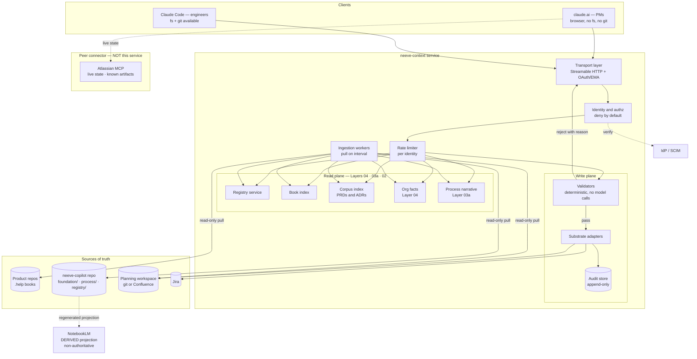
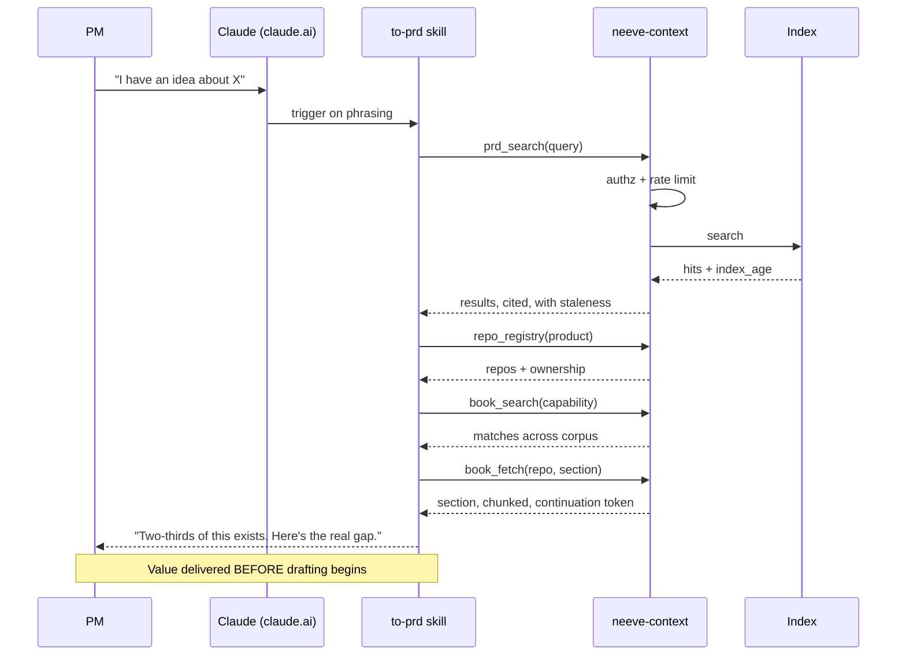
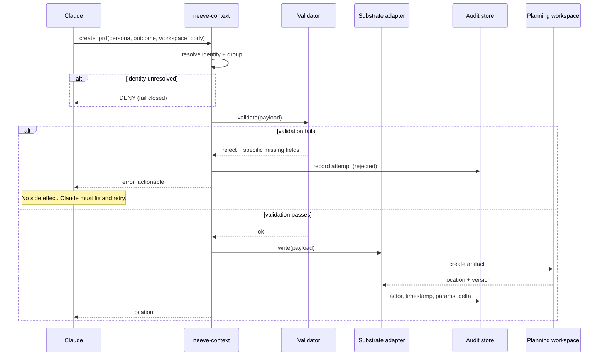
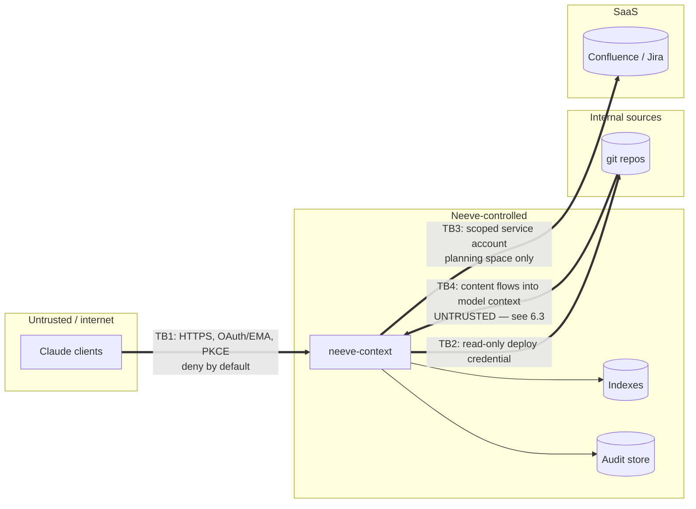

# Architecture: Neeve Context Connector

> [!WARNING]
> **WITHDRAWN — 2026-09-02. This describes a service that will not be built.**
>
> The `neeve-context` MCP server was justified almost entirely by supporting a browser-only
> population on claude.ai. With that surface out of scope and every population holding a git
> clone, its read plane collapses into a file read and its write plane into a pre-commit
> linter. See decision **D7** in [`../../ARCHITECTURE.md`](../../ARCHITECTURE.md) §15 for the
> scorecard and the trigger condition that would reopen this.
>
> Retained so the reasoning stays findable rather than being rebuilt from scratch.

---

**Feature slug:** `neeve-context-connector`
**Status:** Draft — architecture lock candidate
**Governing PRD:** `PRD.md`
**Engineering spec:** `DESIGN-SPEC.md`
**Last updated:** 2026-08-27

This document is the Stage 2 (Design) artifact of the Design Loop: system boundaries, owned
interfaces, and component/data-flow diagrams **locked** before spec prose is written. Per
`to-spec` Phase 3.5, a change to anything in §2 or §3 after the spec starts means returning
here, not patching prose around a design gap.

---

## 1. Architectural thesis

One sentence: **`neeve-context` is a read-through aggregating projection of knowledge Neeve
already owns, plus a governed write path that is the only enforcement point available to
users who have no filesystem.**

Everything about the design follows from four constraints, three of them external:

| Constraint | Source | Consequence |
|---|---|---|
| Browser clients have no filesystem, no git | Platform | MCP is the *only* grounding channel for PMs |
| Org instructions are advisory; tool approval is friction, not a block | Platform (documented) | Enforcement must live in a write tool we own |
| Tool results cap ~150k chars; calls time out at 300s | Platform | Search-then-fetch, never bulk serve |
| The framework's rule: deterministic checks never call models | This repo's own principle | Validators are mechanical, always |

---

## 2. System boundaries

Locked. Each entry states what the system owns and its dependency *kind* — authoritative,
derived, cache-only, transport-only, or out of scope — per `to-spec`'s dependency-naming
rule.

| System | Role | Owns | Kind |
|---|---|---|---|
| **`neeve-context` service** | This build | Index, validators, audit log, substrate routing — **Layers 04, 03a, 03b-as-config, and 02** | — |
| Claude clients (claude.ai, Claude Code) | Consumer | Nothing; they call tools | transport-only |
| `neeve-copilot` repo | Knowledge source | **Layer 04** (`foundation/`), **Layer 03a** narrative (`process/narrative/`), **Layer 03b** executable rules (`process/gates/`, `workflow.yaml`, `tiers.yaml`), registry config | **authoritative** |
| Product repos (`.help/` books) | Knowledge source | Book content; the repo is authoritative for its own book | **authoritative** |
| NotebookLM | **Derived research surface** | Nothing authoritative. A regenerated projection of the git corpus for exploratory synthesis | **derived, disposable** |
| Planning workspace (git repo **or** Confluence) | Artifact store | PRDs, ERDs, ADRs | **authoritative** |
| Jira | Artifact store | Work items | **authoritative** |
| Book/corpus index | Internal | Searchable projection of the above | **derived, cache-only** |
| Audit store | Internal | Write history | **authoritative** — the only copy that exists |
| IdP (via SCIM/EMA) | Identity | Identity, group membership | **authoritative** |
| Atlassian / AWS connectors | Peer | Live external state | out of scope |
| Building equipment, OT networks | — | — | **out of scope, permanently.** No path exists or will |

**The one asymmetry worth internalising:** every index is derived and disposable — losable
without consequence, rebuildable from source. The **audit store is authoritative and
irreplaceable**, because commercial claude.ai provides no artifact audit log of its own. It
is the only component here whose loss is unrecoverable, and it should be designed with that
in mind rather than treated as a log file.

**The layer map this service is scoped against** (see ADR-11, which supersedes ADR-9):

| Layer | System of record | Delivery | Served by |
|---|---|---|---|
| 04 Foundation, personas, customers | git `neeve-copilot/foundation/` | **QUERY** | **`neeve-context`** |
| 03a Process — narrative | git `neeve-copilot/process/narrative/` | **QUERY** | **`neeve-context`** |
| 03b Process — executable rules | git `neeve-copilot/process/gates/` | PULL + code-gen | CI and validators, read directly |
| 02 Repo & code context | git `.help/` books | PULL | **`neeve-context`** |
| 02 Product/feature artifacts | Confluence or git planning repo *(open)* | QUERY / delegate | Atlassian MCP + **`neeve-context`** writes |
| 02 Live work state | Jira | delegate, never cache | Atlassian MCP |
| 01 Task frame | nowhere — assembled at runtime | — | none |

**The invariant this table must not be read as violating:** Layers 04 and 03a being *stored*
in git does **not** make them ambient. They remain QUERY-channel — pulled on demand, never
rendered into the always-on block. Storage location and delivery channel are independent
decisions, and collapsing them is how the 469-line payload gets reinvented.

---

## 3. Component and data flow

### 3.1 Component graph

Two things the diagram is drawn to show. **`neeve-copilot` is now the single git source for
Layers 04, 03a, and 03b** — so the narrative and the rules that enforce it are reviewable in
one diff (ADR-10 as amended). And **NotebookLM has moved out of the request path entirely**:
it is a regenerated projection of the git corpus for exploratory synthesis, not a source
anything reads authoritatively.

Atlassian remains a genuine peer for live state, queried by the model directly.

Note that the reject arrow returns to the transport layer without touching a substrate.
**A rejected write performs no side effect and is still audited** — see §3.4.

### 3.2 Read path — the grounding sequence

### 3.3 Write path — where enforcement lives

### 3.4 Trust boundaries

**TB4 is the boundary most likely to be missed.** Traffic across TB1–TB3 is what a
conventional review looks at. TB4 is the direction nobody watches: content ingested from
repos becomes text in a model's context window, which makes this service a
prompt-injection carrier by construction. Treated as an unresolved gap, not a solved
problem (§6.3).

---

## 4. Owned interfaces

### 4.1 MCP surface

Modelled as **tools** where parameterised and **resources** where static and addressable.
Platform support for tools, resources, and prompts is confirmed; the *UX* for prompts on
claude.ai is not documented, so no design decision depends on it.

| Name | Kind | Auth scope | Notes |
|---|---|---|---|
| `repo_registry` | tool | read:registry | Filterable by product/owner |
| `book_search` | tool | read:books | Cross-repo; returns ranked sections + `index_age` |
| `book_fetch` | tool | read:books | One section; chunked, continuation token |
| `prd_search` | tool | read:corpus | PRDs + ADRs |
| `org_facts` | resource | read:facts | **Layer 04** — personas, customers, conventions. Reinstated by ADR-11 |
| `process_narrative` | resource | read:process | **Layer 03a** — stage rationale, what good looks like. Reinstated by ADR-11 |
| `create_prd` | tool | write:prd | **Validating.** Rejects on failure |
| `create_work_items` | tool | write:items | **Validating** |
| `record_decision` | tool | write:adr | **Validating** |
| `record_lesson` | tool | write:lesson | Only web path for the feedback loop |

### 4.2 Configuration interface

Substrate selection, staleness thresholds, ingestion interval, group→scope mapping, result
caps. Config is declarative and versioned in `neeve-copilot`; the service reads it, never
owns it.

### 4.3 Ingestion interface

Read-only git pull per registered repo; path convention `.help/{introduction,index,appendix,memory,lessons}.md`.
Registration is a config entry, not code.

### 4.4 Audit interface

Append-only writer plus an export endpoint. No update or delete operation exists at any
layer, including for operators.

---

## 5. Architecture decisions

Each records alternatives, because a decision without a rejected alternative is a
preference.

### ADR-1 — Aggregator, never a source of truth

**Decision.** The service serves facts owned elsewhere. It holds no fact whose only copy
lives inside it, with the single deliberate exception of the audit log.

**Alternatives.** (a) A curated knowledge base with its own editing surface — rejected: it
becomes a fourth place a fact lives and kills "one fact, one place," the property that makes
the whole framework maintainable. (b) A cache with write-back — rejected: write-back makes
the cache authoritative in practice whatever the diagram claims.

**Consequences.** Indexes are disposable and rebuildable. Corpus quality is capped by source
quality — the service cannot be better than the books, and should not pretend to be.

### ADR-2 — Pull-based ingestion, not push from repos

**Decision.** The service pulls from git on an interval. Product repos are not modified.

**Alternatives.** (a) Each repo pushes its book on merge via CI — rejected: requires a
change committed into ~16 product repos, violating the framework's
nothing-per-product-repo property, and re-creates the per-repo bot-PR pattern this repo
already tried and abandoned. (b) Webhooks — rejected for v1: more moving parts than an
interval buys, and the freshness gain is minutes on a corpus that changes daily.

**Consequences.** Freshness is bounded by the interval, so **staleness must be surfaced
rather than hidden** (ADR-8). Adding a repo is a config entry.

### ADR-3 — Own the governed write path

**Decision.** Governed artifacts are written by our tools, not by the generic Atlassian
connector.

**Alternatives.** (a) Delegate writes to the Atlassian connector and validate advisorily —
rejected: validation the caller can route around is decoration. (b) Post-hoc validation
that flags bad artifacts after creation — rejected: that is the `Surfaced` tier, and the
PRD requires `Blocked`.

**Consequences, one of them a launch blocker.** We duplicate a slice of Atlassian
integration — accepted cost. And critically: **the gate only holds if the raw Confluence/Jira
write path is set to `blocked` for the PM group.** An open bypass makes every validator in
this design decorative. This is a deployment requirement, not a hardening task.

### ADR-4 — Validators are deterministic; the server never calls a model

**Decision.** No LLM inference inside the service. Validation is field presence, shape,
referential checks against the registry, and enumerations.

**Alternatives.** (a) An LLM judge for "is this outcome actually measurable?" — rejected on
two grounds: it extends the repo's existing hooks-never-call-models rule, which exists for
good reason, and **a validator that reasons can be reasoned with.** A mechanical gate cannot
be argued out of its own rule; a model-based one can. (b) Hybrid, mechanical-then-model —
rejected for v1 as the worst of both: nondeterministic outcomes with mechanical latency.

**Consequences.** Gates are crude but incorruptible. "Has a measurable outcome" degrades to
"has a non-empty outcome field matching a metric-shaped pattern." Honest limitation: this
catches omission, not vagueness.

### ADR-5 — Search-then-fetch, never bulk serve

**Decision.** Reads return ranked pointers plus a bounded excerpt; full sections require a
second call, chunked with a continuation token.

**Alternatives.** (a) Serve whole books — impossible: 16 books blow the ~150k character cap.
(b) Serve an ever-larger summary — rejected: reproduces the always-on-context bloat problem
this whole redesign exists to fix, one layer down.

**Consequences.** Two round trips for depth. Truncation is explicit and signalled; a
silently clipped result is treated as a defect, not a limitation.

### ADR-6 — Enterprise Managed Auth for the write plane; static headers only for the read pilot

**Decision.** EMA (signed IdP assertion, silent connect) is required before any write tool
is enabled. Static-header auth is acceptable for Phase A read-only.

**Alternatives.** (a) Per-user OAuth with dynamic client registration — rejected: a consent
dance for every PM is the support burden that kills adoption. (b) Static headers throughout —
rejected for writes: one org-wide shared credential makes per-actor attribution impossible,
and attribution is the entire point of the audit log.

**Consequences.** Write plane depends on IdP configuration and SCIM. No SCIM means no
PM-only scoping and no trustworthy actor attribution.

### ADR-7 — Read and write planes deploy and disable independently

**Decision.** Separate tool permissions, separate rollout phases, separate kill switches.

**Alternatives.** Ship as one unit — rejected: a bad validator would then take grounding
down with it, and grounding is the part that already works.

**Consequences.** Phase A delivers value with near-zero blast radius and tests the
discoverability assumption before any write code matters.

### ADR-8 — Staleness is surfaced, and stale-beyond-threshold refuses to answer

**Decision.** Every read carries `index_age`. Past a configured threshold the tool returns
an explicit staleness error instead of a plausible answer.

**Alternatives.** (a) Serve anyway, silently — rejected: this is precisely the framework's
worst failure mode, a confident answer from a stale map. (b) Serve with a soft warning —
rejected: warnings in tool output get skimmed, by models and humans alike.

**Consequences.** An ingestion outage becomes a loud read failure rather than quiet
misinformation. Availability of ingestion is therefore part of the service SLO, not a
background nicety.

### ADR-9 — ~~Layers 03/04 live exclusively in NotebookLM~~ — **SUPERSEDED by ADR-11 (2026-08-28)**

> Retained for the record, per this repo's append-only decision discipline. The reasoning
> below was sound on its own terms but rested on a conflation identified in ADR-11: it
> treated Layer 04 as *authored* by non-engineers when it is **read by many, written by few,
> rarely**. Read ADR-11 first.

**Context.** Company foundation, personas, customers, and process narrative are static,
prose-shaped, and rarely all-relevant. They are a **reference corpus**, not a records
system — the job is retrieval with citations, not workflow, permissions, or required fields.

**Decision.** NotebookLM is the sole system of record for Layers 03 and 04. It is a **peer
connector queried by the model**, not a backend this service polls. `neeve-context` neither
serves nor caches this content.

**Alternatives.**
(a) *Mirror Layer 03/04 into this service's index for unified search* — rejected: it
manufactures a second authoritative source for the same facts, which is the precise failure
"one fact, one place" exists to prevent. A labelled mirror still drifts, and a drifted
mirror is consulted with the same confidence as the original.
(b) *This service polls NotebookLM server-side and re-serves* — rejected on a hard
constraint: NotebookLM's auth is personal and interactive, so no reliable server-side
identity exists. A service depending on it would fail exactly where automation matters
most, in headless and scheduled runs.
(c) *Move Layer 03/04 into git and serve from here* — rejected: it is authored and consumed
as narrative by non-engineers, and forcing a git workflow on the audience is the problem
this whole programme exists to remove.

**Consequences.**
- The service gets materially smaller — two retired capabilities, one fewer ingestion source,
  no credential for NotebookLM.
- Routing becomes the ambient block's primary job: *"foundation and process live in
  NotebookLM; query it, never answer from memory."*
- **Accepted cost:** no diff, no review, and no citable version history for Layers 03/04.
  Tolerable for quarterly narrative; a real loss for engineering principles, which get
  argued about. Named in PRD §9 gap 8 rather than left to be discovered.
- **Accepted cost:** federated discovery has no single entry point (PRD §9 gap 9).
- If NotebookLM is unavailable, the model loses foundation and process context outright.
  This service **must not substitute or approximate** — a plausible answer from the wrong
  source is worse than an admitted absence.

### ADR-10 — Split process narrative from executable rules

**Context.** Layer 03 is "processes," but process exists in two irreconcilable forms: prose
a human reads to understand *why*, and data a machine reads to *enforce*.

**Decision.** Narrative → NotebookLM with the rest of Layer 03. **Executable rules** — gate
commands, validation predicates, acceptance contracts as data — stay in git under
`neeve-copilot`, read directly by CI and by this service's validators. Same process, two
representations, exactly one authoritative for each purpose.

**Alternatives.**
(a) *Everything in NotebookLM* — rejected: **a validator that fetches its rulebook from an
interactively-authenticated cloud notebook is not a validator.** The entire `Blocked` tier
requires rules readable by a headless process with no human present.
(b) *Everything in git* — rejected: that is alternative (c) of ADR-9, and it puts the
narrative out of reach of its actual audience.
(c) *Generate the narrative from the rules* — rejected: the interesting half of process
documentation is the reasoning, which does not derive from a predicate.

**Consequences, as amended by ADR-11.** Both halves now live in the same git repo —
`process/narrative/` beside `process/gates/` — so the split is a *file-format* distinction
(prose vs YAML) rather than a system boundary. The risk ADR-10 was written to mitigate
(the two descriptions disagreeing) largely dissolves: they are reviewable in one diff, by
one reviewer, in one PR. The executable half still bites, so residual disagreement surfaces
as a failed gate rather than silent divergence.

### ADR-11 — Layers 04 and 03a live in git and are served by this service (supersedes ADR-9)

**Context.** ADR-9 placed Layers 04 and 03a exclusively in NotebookLM on the grounds that
they are a static prose corpus best served by retrieval-with-citations, and that forcing a
git workflow on a non-engineering audience defeats the purpose.

**The error.** That reasoning conflated **consumption** with **authoring**. Layer 04 is
company identity, personas, and customers: *read by many, written by few, rarely* — quarterly
at most, by a small group. The audience argument applies to reading, and reading is solved by
serving it over MCP. Only authoring needs git, and authoring is the rare case. The
daily-authoring problem is PRDs, which are Layer 02 and retain a browser write path
regardless.

**Decision.** Layer 04 lives at `neeve-copilot/foundation/`; Layer 03a narrative lives at
`neeve-copilot/process/narrative/`. Both are ingested and served by this service as MCP
resources. NotebookLM is demoted to a **derived, non-authoritative projection** regenerated
from the git corpus for exploratory synthesis.

**Why this is better.**
1. **The ADR-10 seam collapses.** Narrative and rules become reviewable in one diff.
2. **Change history returns** — diff, blame, PR discussion, and the existing CI citation
   checks. This was the explicitly accepted cost of ADR-9 and it was the largest one.
3. **A failure mode disappears.** ADR-9's design could not read Layer 03/04 server-side at
   all, because NotebookLM's auth is personal and interactive. CI and this service can both
   read git.
4. **Discoverability risk shrinks.** Three peers become two. *"Ask `neeve-context` for
   anything about Neeve"* is a far easier instruction to get right in a 40-line budget than a
   three-way routing split — and discoverability is the single largest risk in the programme.
5. **A migration prerequisite disappears.** No one-time extraction into a notebook corpus;
   instead a restructure of markdown already under version control.

**Alternatives.**
(a) *Keep ADR-9* — rejected on the four points above.
(b) *Confluence as SoR for Layer 04* — rejected: it separates the narrative from the rules
again and gives up CI checks, for a browser-authoring benefit that quarterly cadence does not
need.
(c) *Bundle it into the ambient block instead of serving it* — rejected emphatically. See the
consequence below.

**Consequences.**
- **The critical one:** storage and delivery are independent decisions, and this changes only
  storage. Layers 04/03a remain **QUERY-channel**. If they drift into `ambient/` and get
  rendered into the always-on block, Move 2 is undone and the 469-line payload is reinvented
  with extra steps. This is the most likely way for this decision to go wrong later.
- **This service becomes more load-bearing.** A connector outage now costs PMs Layers 04 and
  03a as well as 02. Fewer peers is better for routing and worse for blast radius — a genuine
  trade, and it strengthens the case that the availability owner must be settled before the
  write plane ships.
- Layer 04 authoring for non-engineers is a PR through GitHub's web UI: browser-based, no
  terminal, adequate at quarterly cadence. A `propose_foundation_change` write tool that
  opens a PR would be more elegant and is deliberately out of scope.

---

## 6. Cross-cutting concerns

### 6.1 Failure modes

| Mode | Detection | Behaviour | Recovery |
|---|---|---|---|
| Service down | Health check, client error | PMs lose all grounding; engineers degrade gracefully | Restart / redeploy. **Asymmetry is inherent** |
| Ingestion stalled | `index_age` exceeds threshold | Reads refuse (ADR-8) | Fix ingestion; index rebuilds from source |
| Index corrupted | Checksum on rebuild | Rebuild from source | No data loss — derived |
| Audit store unavailable | Write attempt fails | **Writes must fail closed.** No unaudited write, ever | Restore before re-enabling writes |
| Substrate unavailable | Adapter error | Write fails with a clear cause; no partial artifact | Retry; artifact creation is idempotent by slug |
| Validator too strict | Rejection-rate metric | Tune; per-tool disable if urgent | Config, no deploy |
| Credential compromised | Out of band | Rotate; revoke; audit-log review | Read credential is read-only, limiting damage |
| Bypass left open | Deployment check | Gate silently decorative | Set raw write tools to `blocked` |
| **Service down — post-ADR-11 blast radius** | Health check, client error | **PMs now lose Layers 04, 03a *and* 02 together.** Consolidation bought better routing at the cost of a wider single point of failure | Restart / redeploy. Availability owner is a Phase-B blocker, and ADR-11 raises the stakes on it |
| NotebookLM projection stale or absent | Nobody, by design | **No functional impact** — it is derived and non-authoritative (ADR-11) | Regenerate from git |

### 6.2 Non-functional requirements

- **Latency.** Read p95 < 2s, p99 < 5s — far inside the 300s platform timeout, because the
  binding constraint is a PM's patience, not the protocol's.
- **Result size.** Hard server-side cap below ~150k characters, with explicit truncation.
- **Availability.** Needs a stated SLO and a named owner. **Both currently absent** — PRD
  §9 gap 3, and a Phase-B blocker.
- **Rate limiting.** Per identity. Platform limits are undocumented, so self-throttle rather
  than discover them in production.
- **Observability.** Per-tool call count, latency, rejection rate and reason distribution,
  `index_age` per source, audit-write success rate. The rejection-reason distribution is the
  signal that tells you whether the gates teach or merely obstruct.

### 6.3 Security

**Fail-closed everywhere.** Unresolved identity → deny. Unresolvable group → deny writes.
Audit store unavailable → deny writes. Index stale → deny reads.

**Prompt injection across TB4 — unresolved.** Content ingested from books and PRDs flows
into a model context. A compromised, or merely thoughtless, book could carry
instruction-shaped text. Current design serves content with provenance labels and never
frames it as instruction, which is a convention, **not a control**. Named as PRD §9 gap 1.
It needs a real answer before the corpus admits anything third parties can influence.

**Aggregation.** One credential now reaches what previously required access to sixteen
repositories. The property that makes the service useful is the property that makes it worth
attacking; the read credential being read-only is the main structural mitigation.

**Secrets.** Never in tool results. Book content is scanned for credential-shaped strings at
ingestion and quarantined rather than indexed.

---

## 7. Deployment topology

Single stateless service behind TLS, horizontally scalable; index and audit in managed
stores in a Neeve-controlled region (PRD §7 data residency). Ingestion workers run
separately from request serving so an ingestion stall degrades freshness without degrading
latency.

**Environments.** Dev (synthetic corpus), staging (real corpus, no write substrate — writes
go to a scratch space), production. Staging deliberately cannot write to the real planning
workspace.

**The CI constraint, restated because it bites.** A CI gate cannot depend on this
connector — interactively-authenticated servers are absent in headless runs. Engineer-side
`Blocked` gates therefore stay git/CI-local. A service-account path for CI is technically
possible and explicitly unscoped here.

---

## 8. What this architecture deliberately does not do

- **No rendering of Layer 04/03a into the ambient block.** They are stored in git and
  **served on query** (ADR-11). Storage is not delivery; conflating them reinvents the
  469-line payload.
- No client relationship with any peer connector. This service does not call Atlassian MCP
  and holds no credential for it. **MCP is a model↔service protocol; service↔service
  integration uses native APIs** — which is why the Confluence *indexing* path (S10) uses
  Confluence REST with a service account rather than proxying Atlassian MCP.
- No UI. Claude is the client.
- No model calls server-side (ADR-4).
- No multi-tenancy. Internal identities only.
- No push, no subscriptions — unsupported by the platform and unnecessary.
- No write path for the design discipline in v1.
- No replacement of existing connectors for live external state.
- No path to OT networks or building equipment. Not now, not later.

---

## 9. Design lock checklist

| Item | Status |
|---|---|
| System boundaries named with dependency kinds (§2) | ✅ |
| Component graph (§3.1) | ✅ |
| Read and write sequence diagrams (§3.2, §3.3) | ✅ |
| Trust boundaries, including content-into-context (§3.4) | ✅ |
| Owned interfaces enumerated (§4) | ✅ |
| Decisions recorded with rejected alternatives (§5) | ✅ ADR-1…ADR-11 (ADR-9 superseded, retained) |
| Layer scoping explicit; peers distinguished from owned surface (§2, §3.1) | ✅ |
| Storage/delivery independence stated where it could be misread (§2, §5 ADR-11, §8) | ✅ |
| Failure modes with fail-closed behaviour (§6.1) | ✅ |
| NFRs stated | ⚠️ **Availability SLO and owner absent** — PRD §9 gap 3 |
| Security, with unresolved items named (§6.3) | ⚠️ **Prompt injection undefended** — PRD §9 gap 1 |

**Lock status: conditional.** Structurally locked for spec-writing. The two ⚠️ items are
Phase-B blockers and do not block Phase A read-only work, since neither the write plane nor
third-party-influenced content exists in that phase.
